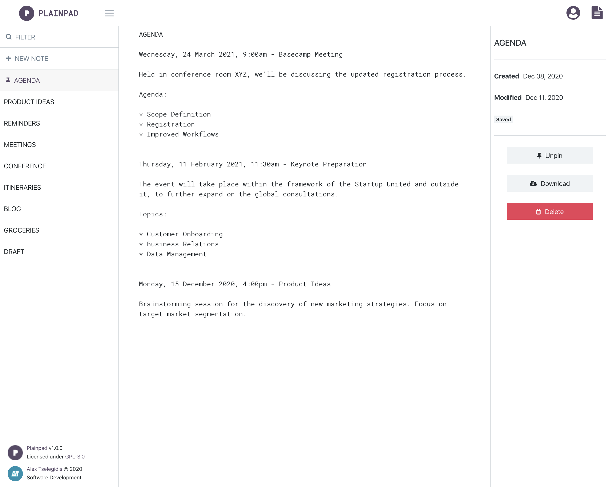

<h1 align="center">
    <br>
        <a href="https://alextselegidis.com/get/plainpad">
            
        </a>
        <br>
        Plainpad
    <br>
</h1>

<h4 align="center">
    Plainpad is a self hosted note taking application.
</h4>

<h4 align="center">
    <a href="https://alextselegidis.com/get/plainpad">alextselegidis.com/get/plainpad</a>
</h4>

<p align="center">
  <a href="#about">About</a> •
  <a href="#setup">Setup</a> •
  <a href="#license">License</a>
</p>



## About

Motivated by simplicity and stability in mind, Plainpad offers great potential at no cost. Become the owner of 
your data as Plainpad will nicely run on your server. 

This project was built with React for the frontend and Lumen for the backend code. 

## Setup

To clone and run this application, you'll need [Git](https://git-scm.com) and [Node.js](https://nodejs.org/en/download/) 
(which comes with [npm](http://npmjs.com)) installed on your computer. From your command line:

```bash
# Clone this repository
$ git clone https://github.com/alextselegidis/plainpad.git

# Go into the repository
$ cd plainpad

# Setup Project
$ ./project setup
```

Note: If you're using Linux Bash for Windows, [see this guide](https://www.howtogeek.com/261575/how-to-run-graphical-linux-desktop-applications-from-windows-10s-bash-shell/) or use `node` from the command prompt.


## License 

Code Licensed Under [GPL v3.0](https://www.gnu.org/licenses/gpl-3.0.en.html) | Content Under [CC BY 3.0](https://creativecommons.org/licenses/by/3.0/)

---

Website [alextselegidis.com](https://alextselegidis.com) &nbsp;&middot;&nbsp;
GitHub [alextselegidis](https://github.com/alextselegidis) &nbsp;&middot;&nbsp;
Twitter [@alextselegidis](https://twitter.com/AlexTselegidis)

###### More Projects On Github
###### ⇾ [**Easy!Appointments** Open Source Appointment Scheduler](https://github.com/alextselegidis/easyappointments)
###### ⇾ [**Questionful** Web Questionnaires Made Easy](https://github.com/alextselegidis/questionful)
###### ⇾ [**Integravy** Service Orchestration At Your Fingertips](https://github.com/alextselegidis/integravy)
 
